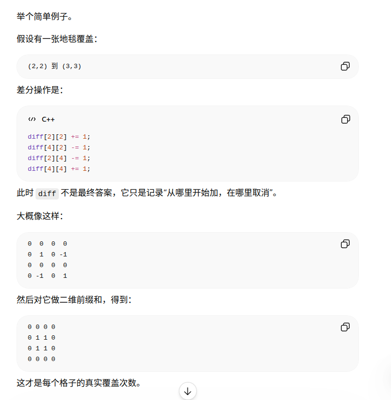

这个任务信息量很大，让我系统地搜索一下各知识点的题单，确保给你的题目质量和数量都够。好，信息收集够了，现在给你整理一份完整的题单，每个知识点配足够的题目，按难度递进排列。

---

## 蓝桥杯 B 组完整备考题单

---

### 一、前缀和 & 差分

**模板：**
```cpp
// 一维前缀和
for (int i = 1; i <= n; i++) pre[i] = pre[i-1] + a[i];
// 查询 [l,r] 区间和
int sum = pre[r] - pre[l-1];
// 一维差分：对 [l,r] 全部加 c
diff[l] += c; diff[r+1] -= c;


// 还原：对 diff 求前缀和


// 二维前缀和建立
s[i][j] = s[i-1][j] + s[i][j-1] - s[i-1][j-1] + a[i][j];
// 查询左上(x1,y1)到右下(x2,y2)
s[x2][y2] - s[x1-1][y2] - s[x2][y1-1] + s[x1-1][y1-1];

//二维差分：初始化
diff[i][j] = a[i][j] - a[i-1][j] - a[i][j-1] + a[i-1][j-1]
// 二维差分：对子矩阵(x1,y1)→(x2,y2)全部加c
d[x1][y1]+=c; d[x1][y2+1]-=c; d[x2+1][y1]-=c; d[x2+1][y2+1]+=c;
```

| 难度 | 题目 | 链接 | 考点 |
|---|---|---|---|
| ⭐ | B3612 求区间和 | [链接](https://www.luogu.com.cn/problem/B3612) | 一维前缀和入门 |
| ⭐⭐ | P2367 语文成绩 | [链接](https://www.luogu.com.cn/problem/P2367) | 一维差分 |
| ⭐⭐ | P2004 领地选择 | [链接](https://www.luogu.com.cn/problem/P2004) | 二维前缀和 |
| ⭐⭐ | P3397 地毯 | [链接](https://www.luogu.com.cn/problem/P3397) | 二维差分 |
| ⭐⭐⭐ | P1115 最大子段和 | [链接](https://www.luogu.com.cn/problem/P1115) | 前缀和思维 |
| ⭐⭐⭐ | P3131 USACO 子序列 | [链接](https://www.luogu.com.cn/problem/P3131) | 前缀和综合 |


[P1719 最大加权矩形](https://www.luogu.com.cn/problem/P1719)
``` cpp
#include <bits/stdc++.h>
using namespace std;

int main(){
    int n;
    cin >> n;

    int a[125][125];
    int sum[125][125];

    int ans=INT_MIN;

    for(int i=1;i<=n;i++){
        for(int j=1;j<=n;j++){
            cin >>a[i][j]; 

            sum[i][j]=a[i][j]+sum[i][j-1]+sum[i-1][j]-sum[i-1][j-1];
    
            
        }
        
    }

    // 枚举所有矩形
    for (int x1 = 1; x1 <= n; x1++) {
        for (int y1 = 1; y1 <= n; y1++) {
            for (int x2 = x1; x2 <= n; x2++) {
                for (int y2 = y1; y2 <= n; y2++) {
                    int rect_sum = sum[x2][y2] 
                                 - sum[x1-1][y2] 
                                 - sum[x2][y1-1] 
                                 + sum[x1-1][y1-1];
                    ans = max(ans, rect_sum);
                }
            }
        }
    }

    

    cout << ans;
    
}
```
#### B3612 求区间和

```cpp
#include <bits/stdc++.h>

typedef long long ll;
const int N=1e5+10;
ll pre[N];

using namespace std;

int main(){
    ll n;
    cin >> n;

    for(ll i=1;i<=n;i++){
        ll a;
        cin >> a;
        pre[i]=pre[i-1]+a;
    }   


    ll m;
    cin >> m;

    for(ll i=1;i<=m;i++){
        ll l,r;
        cin >> l>> r;

        ll res=pre[r]-pre[l-1];

        cout << res << endl;
    }


    


    return 0;
}
```


#### P2367 语文成绩
``` cpp
#include <bits/stdc++.h>

typedef long long ll;
const int N=5e6+10;
ll diff[N],a[N];

using namespace std;

int main(){
    ll n,p;
    cin >> n >>p;
    for(ll i=1;i<=n;i++){
        cin >> a[i];
        diff[i]=a[i]-a[i-1];
    }

    for(ll i=1;i<=p;i++){
        ll x,y,z;
        cin >> x>>y>>z;

        diff[x]+=z;
        diff[y+1]-=z;
    }

    ll sum=0;
    ll minn=LLONG_MAX;
    
    for(ll i=1;i<=n;i++){
        sum+=diff[i];
        minn=min(minn,sum);
    }

    cout << minn;

    return 0;
}
```
#### P2004 领地选择

``` cpp
#include <bits/stdc++.h>
using namespace std;

typedef long long ll;

const int N=1e3+10;

ll a[N][N],pre[N][N];

int main(){
    ll n,m,c;
    cin >> n >> m >> c;

    //初始化
    for(ll i=1;i<=n;i++){
        for(ll j=1;j<=m;j++){
            cin >> a[i][j];

            pre[i][j]=a[i][j]+pre[i-1][j]+pre[i][j-1]-pre[i-1][j-1];
        }
        
    }

    ll sum=0;
    ll maxn = LLONG_MIN;
    ll ansx=1,ansy=1;

    //i 是正方形左上角的行号
    for (ll i = 1; i + c - 1 <= n; i++) {
        for (ll j = 1; j + c - 1 <= m; j++) {
            ll x1=i;
            ll y1=j;
            ll x2=i+c-1;
            ll y2=j+c-1;


            ll sum=pre[x2][y2]-pre[x2][y1-1]-pre[x1-1][y2]+pre[x1-1][y1-1];

            if(sum>maxn){
                maxn=sum;
                ansx=i;
                ansy=j;
            }
        
        }
    }


    cout << ansx << " "<< ansy;
    
    return 0;


    
}


```
#### P3397 地毯


``` cpp
#include <bits/stdc++.h>
using namespace std;

typedef long long ll;

const int N=1005;

ll a[N][N],diff[N][N];


int main(){
    ll n,m;
    cin >> n >> m;

    for(ll i=1;i<=m;i++){
        ll x1,y1,x2,y2;
        cin >> x1>>y1>>x2>>y2;

        diff[x1][y1]+=1;
        diff[x2+1][y1]-=1;
        diff[x1][y2+1]-=1;
        diff[x2+1][y2+1]+=1;
    }


     for (ll i = 1; i <= n; i++) {
        for (ll j = 1; j <= n; j++) {
            diff[i][j] = diff[i][j]
                       + diff[i - 1][j]
                       + diff[i][j - 1]
                       - diff[i - 1][j - 1];

            cout << diff[i][j] << " ";
        }
        cout << '\n';
    }


    


    return 0;
}
```
---

### 二、二分

**模板（两种写法记清楚）：**
```cpp
// 找满足条件的最左位置（lower_bound型）
int lo = 0, hi = n;
while (lo < hi) {
    int mid = (lo + hi) / 2;
    if (check(mid)) hi = mid;
    else lo = mid + 1;
}
// 答案是 lo

// 找满足条件的最右位置（二分答案最大值）
int lo = 0, hi = 1e9;
while (lo < hi) {
    int mid = (lo + hi + 1) / 2;  // 注意+1防死循环
    if (check(mid)) lo = mid;
    else hi = mid - 1;
}
// 答案是 lo
```

| 难度 | 题目 | 链接 | 考点 |
|---|---|---|---|
| ⭐ | P2249 查找 | [链接](https://www.luogu.com.cn/problem/P2249) | 二分基本查找 |
| ⭐⭐ | P1873 砍树 | [链接](https://www.luogu.com.cn/problem/P1873) | 二分答案经典 |
| ⭐⭐ | P1678 烦恼的高考志愿 | [链接](https://www.luogu.com.cn/problem/P1678) | 二分查找应用 |
| ⭐⭐ | P2440 木材加工 | [链接](https://www.luogu.com.cn/problem/P2440) | 二分答案 |
| ⭐⭐⭐ | P1824 进击的奶牛 | [链接](https://www.luogu.com.cn/problem/P1824) | 二分答案+贪心check |
| ⭐⭐⭐ | P2678 跳石头 | [链接](https://www.luogu.com.cn/problem/P2678) | NOIP经典二分 |

---

### 三、双指针 & 滑动窗口

**模板：**
```cpp
// 双指针（同向）
int l = 0;
for (int r = 0; r < n; r++) {
    // 加入 r
    while (不满足条件) { // 移动 l
        // 移出 l
        l++;
    }
    // 更新答案
}
```

| 难度 | 题目 | 链接 | 考点 |
|---|---|---|---|
| ⭐ | P1638 逛画展 | [链接](https://www.luogu.com.cn/problem/P1638) | 滑动窗口入门 |
| ⭐⭐ | P2009 跑步 | [链接](https://www.luogu.com.cn/problem/P2009) | 双指针 |
| ⭐⭐ | P1147 连续自然数和 | [链接](https://www.luogu.com.cn/problem/P1147) | 双指针经典 |
| ⭐⭐⭐ | P3701 赶到与目标 | [链接](https://www.luogu.com.cn/problem/P3701) | 综合应用 |

---

### 四、排序 & 贪心

**贪心没有固定模板，核心是"每步选当前最优"，常配合排序使用。**

| 难度 | 题目 | 链接 | 考点 |
|---|---|---|---|
| ⭐ | P1177 快速排序 | [链接](https://www.luogu.com.cn/problem/P1177) | 排序模板 |
| ⭐ | P1090 合并果子 | [链接](https://www.luogu.com.cn/problem/P1090) | 贪心+优先队列 |
| ⭐⭐ | P1803 凌乱的yyy | [链接](https://www.luogu.com.cn/problem/P1803) | 区间调度贪心 |
| ⭐⭐ | P1015 回文数 | [链接](https://www.luogu.com.cn/problem/P1015) | 贪心构造 |
| ⭐⭐ | P2672 推销员 | [链接](https://www.luogu.com.cn/problem/P2672) | 贪心排序 |
| ⭐⭐⭐ | P1080 国王游戏 | [链接](https://www.luogu.com.cn/problem/P1080) | 贪心经典难题 |
| ⭐⭐⭐ | P2123 皇后游戏 | [链接](https://www.luogu.com.cn/problem/P2123) | 排序贪心 |

---
P1233

### 五、DFS（深度优先搜索）

**模板：**
```cpp
int dx[] = {0,0,1,-1}, dy[] = {1,-1,0,0};
bool vis[N][N];

void dfs(int x, int y) {
    if (越界 || vis[x][y] || 障碍) return;
    vis[x][y] = true;
    // 处理当前状态
    for (int i = 0; i < 4; i++)
        dfs(x+dx[i], y+dy[i]);
}

// 回溯模板
void dfs(int step) {
    if (到达终点) { 记录答案; return; }
    for (每种选择) {
        if (可以选) {
            做选择;
            dfs(step+1);
            撤销选择; // 回溯
        }
    }
}
```

| 难度 | 题目 | 链接 | 考点 |
|---|---|---|---|
| ⭐ | P1605 迷宫 | [链接](https://www.luogu.com.cn/problem/P1605) | DFS连通入门 |
| ⭐ | P1596 Lake Counting | [链接](https://www.luogu.com.cn/problem/P1596) | Flood Fill |
| ⭐⭐ | P1219 八皇后 | [链接](https://www.luogu.com.cn/problem/P1219) | 回溯经典 |
| ⭐⭐ | P1101 单词方阵 | [链接](https://www.luogu.com.cn/problem/P1101) | DFS方向枚举 |
| ⭐⭐ | P2036 Perket | [链接](https://www.luogu.com.cn/problem/P2036) | 子集枚举 |
| ⭐⭐⭐ | P1120 小木棍 | [链接](https://www.luogu.com.cn/problem/P1120) | DFS+强剪枝 |
| ⭐⭐⭐ | P1074 靶形数独 | [链接](https://www.luogu.com.cn/problem/P1074) | 剪枝综合 |

---

### 六、BFS（广度优先搜索）

**模板：**
```cpp
queue<pair<int,int>> q;
int dist[N][N];
memset(dist, -1, sizeof(dist));

q.push({sx, sy});
dist[sx][sy] = 0;
while (!q.empty()) {
    auto [x, y] = q.front(); q.pop();
    for (int i = 0; i < 4; i++) {
        int nx = x+dx[i], ny = y+dy[i];
        if (合法 && dist[nx][ny] == -1) {
            dist[nx][ny] = dist[x][y] + 1;
            q.push({nx, ny});
        }
    }
}
```

| 难度 | 题目 | 链接 | 考点 |
|---|---|---|---|
| ⭐ | P1443 马的遍历 | [链接](https://www.luogu.com.cn/problem/P1443) | BFS最短步数 |
| ⭐ | P1162 填涂颜色 | [链接](https://www.luogu.com.cn/problem/P1162) | BFS连通区域 |
| ⭐⭐ | P3958 奶酪 | [链接](https://www.luogu.com.cn/problem/P3958) | BFS+建图 |
| ⭐⭐ | P1135 奇怪的电梯 | [链接](https://www.luogu.com.cn/problem/P1135) | BFS状态转移 |
| ⭐⭐⭐ | P1032 字串变换 | [链接](https://www.luogu.com.cn/problem/P1032) | BFS字符串 |
| ⭐⭐⭐ | P2895 电磁炮 | [链接](https://www.luogu.com.cn/problem/P2895) | BFS综合 |

---

### 七、动态规划

#### 7.1 线性 DP / LIS / LCS

**模板：**
```cpp
// LIS O(n²)
for (int i = 1; i <= n; i++) {
    dp[i] = 1;
    for (int j = 1; j < i; j++)
        if (a[j] < a[i]) dp[i] = max(dp[i], dp[j]+1);
}

// LIS O(n log n)（贪心+二分）
vector<int> tails;
for (int x : a) {
    auto it = lower_bound(tails.begin(), tails.end(), x);
    if (it == tails.end()) tails.push_back(x);
    else *it = x;
}
// tails.size() 即为 LIS 长度

// LCS
for (int i = 1; i <= n; i++)
    for (int j = 1; j <= m; j++)
        dp[i][j] = (a[i]==b[j]) ? dp[i-1][j-1]+1
                                 : max(dp[i-1][j], dp[i][j-1]);
```

| 难度 | 题目 | 链接 | 考点 |
|---|---|---|---|
| ⭐ | P1020 导弹拦截 | [链接](https://www.luogu.com.cn/problem/P1020) | LIS经典 |
| ⭐⭐ | P1439 最长公共子序列 | [链接](https://www.luogu.com.cn/problem/P1439) | LCS模板 |
| ⭐⭐ | P1091 合唱队形 | [链接](https://www.luogu.com.cn/problem/P1091) | LIS变形 |
| ⭐⭐ | P2285 打鼹鼠 | [链接](https://www.luogu.com.cn/problem/P2285) | 线性DP |
| ⭐⭐⭐ | P1233 木棍加工 | [链接](https://www.luogu.com.cn/problem/P1233) | LIS综合 |

#### 7.2 背包 DP

| 难度 | 题目 | 链接 | 考点 |
|---|---|---|---|
| ⭐ | P1048 采药 | [链接](https://www.luogu.com.cn/problem/P1048) | 01背包入门 |
| ⭐ | P1049 装箱问题 | [链接](https://www.luogu.com.cn/problem/P1049) | 01背包变形 |
| ⭐ | P1164 小A点菜 | [链接](https://www.luogu.com.cn/problem/P1164) | 01背包方案数 |
| ⭐⭐ | P1616 疯狂的采药 | [链接](https://www.luogu.com.cn/problem/P1616) | 完全背包 |
| ⭐⭐ | P1776 宝物筛选 | [链接](https://www.luogu.com.cn/problem/P1776) | 多重背包 |
| ⭐⭐ | P1802 5倍经验日 | [链接](https://www.luogu.com.cn/problem/P1802) | 01背包变形 |
| ⭐⭐⭐ | P1833 樱花 | [链接](https://www.luogu.com.cn/problem/P1833) | 混合背包 |
| ⭐⭐⭐ | P2347 砝码称重 | [链接](https://www.luogu.com.cn/problem/P2347) | 背包判定性 |

#### 7.3 区间 DP

**模板：**
```cpp
// 枚举区间长度
for (int len = 2; len <= n; len++)
    for (int i = 1; i+len-1 <= n; i++) {
        int j = i+len-1;
        for (int k = i; k < j; k++)
            dp[i][j] = max(dp[i][j], dp[i][k]+dp[k+1][j]+cost);
    }
```

| 难度 | 题目 | 链接 | 考点 |
|---|---|---|---|
| ⭐⭐ | P1775 石子合并（弱化版）| [链接](https://www.luogu.com.cn/problem/P1775) | 区间DP入门 |
| ⭐⭐⭐ | P1880 石子合并 | [链接](https://www.luogu.com.cn/problem/P1880) | 环形区间DP |
| ⭐⭐⭐ | P2466 回文日期 | [链接](https://www.luogu.com.cn/problem/P2466) | 区间DP变形 |

#### 7.4 记忆化搜索

| 难度 | 题目 | 链接 | 考点 |
|---|---|---|---|
| ⭐⭐ | P1434 滑雪 | [链接](https://www.luogu.com.cn/problem/P1434) | 记忆化搜索经典 |
| ⭐⭐ | P1514 引水入城 | [链接](https://www.luogu.com.cn/problem/P1514) | BFS+记忆化 |
| ⭐⭐⭐ | P2679 子串 | [链接](https://www.luogu.com.cn/problem/P2679) | 记忆化综合 |

#### 7.5 状态压缩 DP（了解即可）

| 难度 | 题目 | 链接 | 考点 |
|---|---|---|---|
| ⭐⭐⭐ | P1433 吃奶酪 | [链接](https://www.luogu.com.cn/problem/P1433) | 状压DP入门TSP |
| ⭐⭐⭐ | P2704 炮兵阵地 | [链接](https://www.luogu.com.cn/problem/P2704) | 状压DP经典 |

---

### 八、图论

#### 8.1 并查集

**模板：**
```cpp
int fa[N];
void init() { iota(fa, fa+N, 0); } // fa[i]=i
int find(int x) { return fa[x]==x ? x : fa[x]=find(fa[x]); }
void unite(int a, int b) { fa[find(a)]=find(b); }
bool same(int a, int b) { return find(a)==find(b); }
```

| 难度 | 题目 | 链接 | 考点 |
|---|---|---|---|
| ⭐ | P3367 并查集模板 | [链接](https://www.luogu.com.cn/problem/P3367) | 基础模板 |
| ⭐⭐ | P1111 修复公路 | [链接](https://www.luogu.com.cn/problem/P1111) | 并查集+排序 |
| ⭐⭐ | P1197 星球大战 | [链接](https://www.luogu.com.cn/problem/P1197) | 并查集逆序 |
| ⭐⭐ | P1525 关押罪犯 | [链接](https://www.luogu.com.cn/problem/P1525) | 带权并查集 |
| ⭐⭐⭐ | P2024 食物链 | [链接](https://www.luogu.com.cn/problem/P2024) | 种类并查集 |

#### 8.2 最短路（Dijkstra）

**模板：**
```cpp
const int INF = 1e9;
vector<pair<int,int>> adj[N]; // adj[u] = {v, w}
int dist[N];

void dijkstra(int s, int n) {
    fill(dist, dist+n+1, INF);
    priority_queue<pair<int,int>, vector<pair<int,int>>, greater<>> pq;
    dist[s] = 0; pq.push({0, s});
    while (!pq.empty()) {
        auto [d, u] = pq.top(); pq.pop();
        if (d > dist[u]) continue;
        for (auto [v, w] : adj[u])
            if (dist[u]+w < dist[v]) {
                dist[v] = dist[u]+w;
                pq.push({dist[v], v});
            }
    }
}
```

| 难度 | 题目 | 链接 | 考点 |
|---|---|---|---|
| ⭐ | P4779 单源最短路（标准版）| [链接](https://www.luogu.com.cn/problem/P4779) | Dijkstra模板 |
| ⭐⭐ | P1339 热浪 | [链接](https://www.luogu.com.cn/problem/P1339) | Dijkstra应用 |
| ⭐⭐ | P1462 通往奥格瑞玛 | [链接](https://www.luogu.com.cn/problem/P1462) | 二分+Dijkstra |
| ⭐⭐ | P1144 最短路计数 | [链接](https://www.luogu.com.cn/problem/P1144) | 方案数统计 |
| ⭐⭐⭐ | P4568 飞行路线 | [链接](https://www.luogu.com.cn/problem/P4568) | 分层图最短路 |

#### 8.3 最小生成树（Kruskal）

**模板：**
```cpp
struct Edge { int u, v, w; };
vector<Edge> edges;
sort(edges.begin(), edges.end(), [](auto&a,auto&b){return a.w<b.w;});

int res = 0, cnt = 0;
for (auto [u, v, w] : edges) {
    if (!same(u, v)) {
        unite(u, v);
        res += w; cnt++;
        if (cnt == n-1) break;
    }
}
```

| 难度 | 题目 | 链接 | 考点 |
|---|---|---|---|
| ⭐ | P3366 最小生成树模板 | [链接](https://www.luogu.com.cn/problem/P3366) | Kruskal模板 |
| ⭐⭐ | P1111 修复公路 | [链接](https://www.luogu.com.cn/problem/P1111) | MST时间问题 |
| ⭐⭐ | P2330 繁忙的都市 | [链接](https://www.luogu.com.cn/problem/P2330) | MST变形 |
| ⭐⭐⭐ | P1991 无线通讯网 | [链接](https://www.luogu.com.cn/problem/P1991) | MST综合 |

#### 8.4 拓扑排序

**模板：**
```cpp
queue<int> q;
for (int i = 1; i <= n; i++) if (indeg[i]==0) q.push(i);
vector<int> topo;
while (!q.empty()) {
    int u = q.front(); q.pop();
    topo.push_back(u);
    for (int v : adj[u])
        if (--indeg[v] == 0) q.push(v);
}
// topo.size()==n 则无环
```

| 难度 | 题目 | 链接 | 考点 |
|---|---|---|---|
| ⭐⭐ | P1113 杂物 | [链接](https://www.luogu.com.cn/problem/P1113) | 拓扑+最长路 |
| ⭐⭐ | P4017 最大食物链 | [链接](https://www.luogu.com.cn/problem/P4017) | 拓扑方案数 |
| ⭐⭐⭐ | P1983 车站分级 | [链接](https://www.luogu.com.cn/problem/P1983) | 建图+拓扑 |

---

### 九、数论

**模板：**
```cpp
// GCD（辗转相除）
int gcd(int a, int b) { return b==0 ? a : gcd(b, a%b); }
int lcm(int a, int b) { return a / gcd(a,b) * b; }

// 快速幂
long long qpow(long long a, long long b, long long mod) {
    long long res = 1; a %= mod;
    for (; b; b >>= 1) {
        if (b & 1) res = res*a % mod;
        a = a*a % mod;
    }
    return res;
}

// 线性筛（欧拉筛）
vector<int> primes;
bool not_prime[N] = {};
for (int i = 2; i < N; i++) {
    if (!not_prime[i]) primes.push_back(i);
    for (int p : primes) {
        if ((long long)i*p >= N) break;
        not_prime[i*p] = true;
        if (i % p == 0) break;
    }
}
```

| 难度 | 题目 | 链接 | 考点 |
|---|---|---|---|
| ⭐ | P3383 线性筛素数 | [链接](https://www.luogu.com.cn/problem/P3383) | 素数筛模板 |
| ⭐ | P1226 快速幂 | [链接](https://www.luogu.com.cn/problem/P1226) | 快速幂模板 |
| ⭐ | P1029 最大公约数 | [链接](https://www.luogu.com.cn/problem/P1029) | GCD/LCM |
| ⭐⭐ | P2261 信息传递 | [链接](https://www.luogu.com.cn/problem/P2261) | 数论+图 |
| ⭐⭐ | P1017 进制转换 | [链接](https://www.luogu.com.cn/problem/P1017) | 进制 |
| ⭐⭐ | P1414 又是毕业季 | [链接](https://www.luogu.com.cn/problem/P1414) | GCD综合 |
| ⭐⭐⭐ | P2152 SuperGCD | [链接](https://www.luogu.com.cn/problem/P2152) | 高精度+GCD |

---

### 十、数据结构

#### 10.1 栈与单调栈

| 难度 | 题目 | 链接 | 考点 |
|---|---|---|---|
| ⭐ | P1981 表达式求值 | [链接](https://www.luogu.com.cn/problem/P1981) | 栈应用 |
| ⭐⭐ | P5788 单调栈模板 | [链接](https://www.luogu.com.cn/problem/P5788) | 单调栈模板 |
| ⭐⭐⭐ | P1901 发射站 | [链接](https://www.luogu.com.cn/problem/P1901) | 单调栈应用 |

#### 10.2 堆（优先队列）

| 难度 | 题目 | 链接 | 考点 |
|---|---|---|---|
| ⭐ | P3378 堆模板 | [链接](https://www.luogu.com.cn/problem/P3378) | 堆基础 |
| ⭐⭐ | P1090 合并果子 | [链接](https://www.luogu.com.cn/problem/P1090) | 堆+贪心 |
| ⭐⭐⭐ | P2085 最小函数值 | [链接](https://www.luogu.com.cn/problem/P2085) | 堆综合 |

#### 10.3 树状数组（了解）

**模板：**
```cpp
int tr[N];
int lowbit(int x) { return x & -x; }
void update(int i, int v) { for (; i<N; i+=lowbit(i)) tr[i]+=v; }
int query(int i) { int s=0; for (; i>0; i-=lowbit(i)) s+=tr[i]; return s; }
// 查询 [l,r] 区间和：query(r) - query(l-1)
```

| 难度 | 题目 | 链接 | 考点 |
|---|---|---|---|
| ⭐⭐ | P3374 树状数组1 | [链接](https://www.luogu.com.cn/problem/P3374) | 单点修改区间查询 |
| ⭐⭐ | P3368 树状数组2 | [链接](https://www.luogu.com.cn/problem/P3368) | 区间修改单点查询 |
| ⭐⭐⭐ | P1908 逆序对 | [链接](https://www.luogu.com.cn/problem/P1908) | 树状数组应用 |

---

### 十一、字符串

| 难度 | 题目 | 链接 | 考点 |
|---|---|---|---|
| ⭐ | P3370 字符串哈希模板 | [链接](https://www.luogu.com.cn/problem/P3370) | 哈希入门 |
| ⭐⭐ | P3375 KMP模板 | [链接](https://www.luogu.com.cn/problem/P3375) | KMP模板 |
| ⭐⭐ | P1102 A-B数对 | [链接](https://www.luogu.com.cn/problem/P1102) | 哈希应用 |
| ⭐⭐⭐ | P4391 无线传输 | [链接](https://www.luogu.com.cn/problem/P4391) | KMP应用 |

---

### 十二、真题训练（最后阶段）

按年份从近到远，限时 4 小时独立完成：

| 届次 | 题目入口 |
|---|---|
| 第十五届（2024）国赛B组 | [链接](https://www.luogu.com.cn/problem/list?tag=355) |
| 第十四届（2023）国赛B组 | [链接](https://www.luogu.com.cn/problem/list?tag=340) |
| 第十三届（2022）国赛B组 | [链接](https://www.luogu.com.cn/problem/list?tag=316) |
| 第十二届（2021）国赛B组 | [链接](https://www.luogu.com.cn/problem/list?tag=290) |
| 第十届（2019）国赛B组 | [链接](https://www.luogu.com.cn/problem/list?tag=249) |

---

按这个顺序走下来，每个知识点做完对应题目再进入下一个，不要贪多跳跃。遇到卡题超过 40 分钟就直接看题解，看完后**一定要自己默写一遍**，这是最关键的步骤。